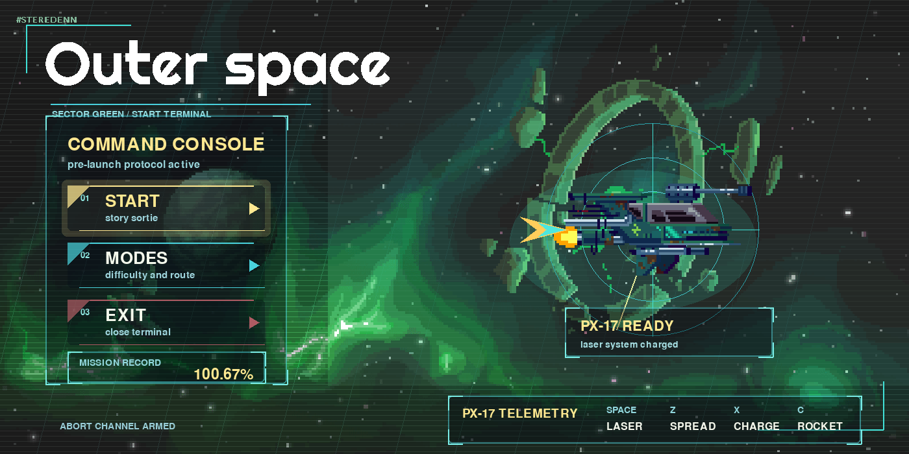
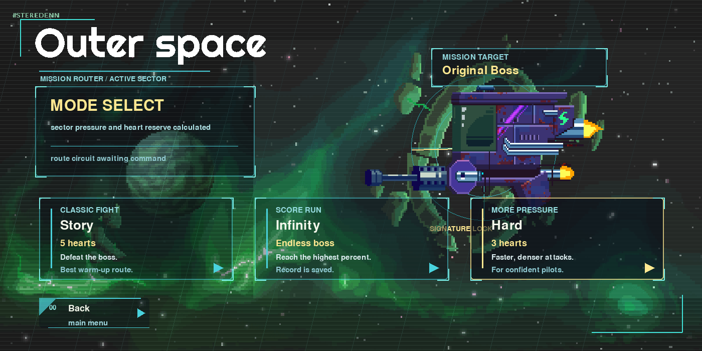
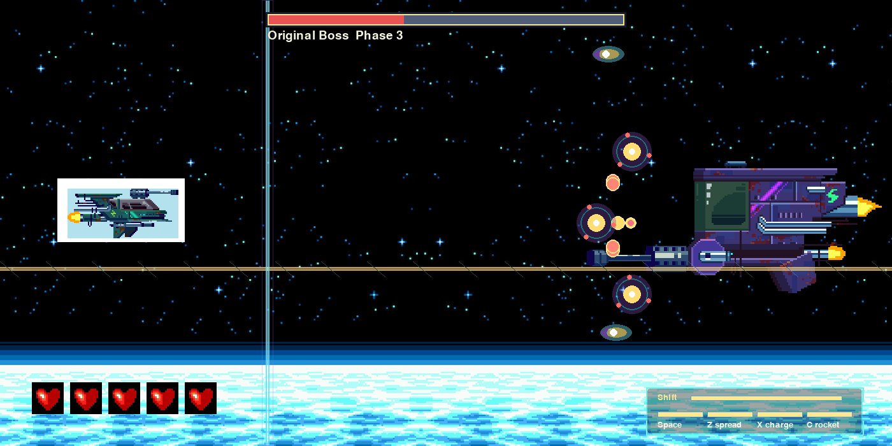
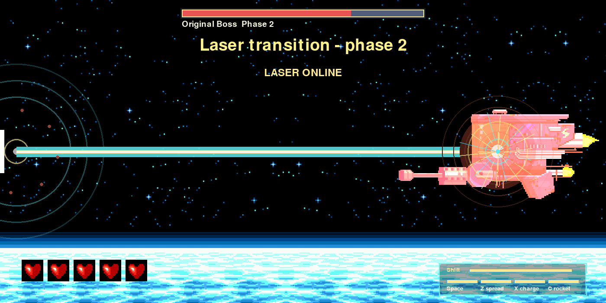

# Outer Space

Outer Space is a full-screen pixel-art boss fight where one small ship faces a massive, evolving war machine in deep space. The game is built around quick reactions, dramatic phase changes, and attack patterns that look dangerous but stay readable enough for a skilled player to survive.

You are not just holding one fire button until the boss disappears. You are choosing weapons, managing cooldowns, dodging environmental hazards, using slow motion at the right moment, and learning how the boss changes from phase to phase.

## Screenshots

| Main Menu | Mode Select |
| --- | --- |
|  |  |

| Boss Fight | Phase Laser |
| --- | --- |
|  |  |

## The Game In Plain English

You control the PX-17, a small ship with several weapons. The boss is huge, heavily armed, and gets more aggressive as the fight goes on. Every phase adds more pressure: new projectile shapes, more arena control, more hazards, and tighter timing.

The player has to make decisions constantly:

- Use Space for steady laser damage.
- Use Z when the screen gets crowded.
- Use X when there is enough time to charge a strong shot.
- Use C when mines, drones, or clustered threats need splash damage.
- Use Shift to slow the world and reposition, knowing that shooting is disabled while slow motion is active.

The result is a fight that rewards both reflexes and judgment. The player survives by reading the screen, not by guessing.

## Why It Feels Different

Most simple space shooters rely on one enemy pattern and one player shot. Outer Space adds more layers:

- Weapon roles matter because special attacks have cooldowns.
- Slow motion is powerful but has a real tradeoff.
- The boss has multiple variants for the same attack family, so the fight does not feel like a fixed script.
- Hazards come from both the boss and the environment.
- Phase transitions are theatrical, not just a health-bar update.

## Game Modes

| Mode | Player Hearts | Boss Behavior | Goal |
| --- | ---: | --- | --- |
| Story | 5 | Standard finite boss | Defeat the boss |
| Infinity | 5 | Boss stays active forever | Push the score as high as possible |
| Hard | 3 | Faster attacks and more boss health | Survive a denser fight |

Story is the main route. Infinity is for score chasing. Hard is for players who already understand the patterns and want a sharper version of the fight.

## Player Weapons

| Key | Weapon | Role |
| --- | --- | --- |
| Space | Quick Laser | Reliable baseline damage |
| Z | Spread Shot | Clears drones and dense projectile lanes |
| X | Charged Plasma | Heavy shot that rewards timing |
| C | Rocket | Splash damage against mines, drones, and grouped threats |

Space is always available. Z, X, and C have longer cooldowns, so they are meant to be used deliberately instead of spammed.

## Slow Motion

Shift activates slow motion. During slow motion:

- The world slows down.
- The player ship becomes faster and easier to reposition.
- Player shooting is disabled.
- The slow-motion meter drains and later recharges.

This turns Shift into an emergency movement tool rather than a free damage boost.

## Boss Attack System

The boss uses several attack families, each with multiple variants:

- Aimed volleys: single shots, double taps, fans, pincers, crossfire, and sniper shots.
- Spiral waves: compact arcs, wide waves, split cannon patterns, and pinwheel bursts.
- Rail beams: tracked lanes, offset traps, brackets, and split-line pressure.
- Lightning attacks: single strikes, cages, and chain patterns.
- Minefields: scattered mines, chase mines, lane formations, and triangle formations.
- Homing pressure: paired bolts, staggered bolts, flanking bolts, and burst setups.
- Nova attacks: ring, spiral, and star-shaped projectile waves.

The boss avoids repeating the same pattern back-to-back when possible, which keeps the fight more varied without making it random noise.

## Phase Transitions

When the boss enters a new phase, the normal fight pauses for a 12-second laser transition:

1. The laser charges.
2. The laser turns on and hits the center of the boss.
3. The boss flashes, sparks, and shakes as if taking damage.
4. The laser shuts down.
5. Normal attacks resume after the cinematic beat.

This transition is visual and dramatic. It does not give the player free boss damage; it is there to make the phase change feel important.

## Controls

| Input | Action |
| --- | --- |
| Arrow Keys | Move the ship |
| Space | Fire quick laser |
| Z | Fire spread shot |
| X | Charge and release plasma |
| C | Fire rocket |
| Shift | Activate slow motion |
| F3 | Toggle debug hitboxes |
| Esc | Leave the current screen or run |

## For Developers

Outer Space is written in Python with pygame. The code is split into small gameplay-focused modules rather than keeping everything in one file.

### Run Locally

Requirements:

- Python 3
- pygame

Install pygame if needed:

```bash
python3 -m pip install pygame
```

Run the game:

```bash
cd project
python3 main.py
```

The game opens in full-screen mode. It renders to an internal `1400x700` canvas and scales that canvas to the display while preserving the aspect ratio.

### Project Structure

```text
Outer-space-game-for-MacOS/
|-- README.md
|-- docs/
|   `-- screenshots/
|-- Outer space presentation.pdf
`-- project/
    |-- main.py             # Entry point
    |-- view.py             # Menus, game loop, HUD, combat orchestration
    |-- sprites.py          # Player, boss, projectiles, hazards, explosions
    |-- boss_entities.py    # Advanced boss attacks and visual effects
    |-- gameplay.py         # Mode health, scoring, arena helpers
    |-- input_state.py      # Keyboard input abstraction
    |-- time_state.py       # Shared time scale for slow motion
    |-- load_image.py       # Asset loading and full-screen presentation
    |-- constants.py        # Gameplay tuning values
    |-- best_score.txt      # Persistent best-score storage
    `-- Data/               # Pixel-art sprites, effects, backgrounds, buttons
```

### Technical Highlights

- Logical resolution: `1400x700`.
- Full-screen presentation with aspect-ratio preserving scaling.
- Mouse coordinate conversion from window space to game space.
- Velocity-based player movement with acceleration, deceleration, tilt, invincibility blinking, and a smaller gameplay hitbox.
- Centralized input state for movement, shooting, slow motion, and debug toggles.
- Shared time scale so slow motion affects movement while real-time timers can continue.
- Boss attack variants selected through a small anti-repeat system.
- Phase transition system that clears hazards, delays boss timers, and renders a non-damaging cinematic laser.
- Best score stored locally in `project/best_score.txt`.

## Current Status

Outer Space is a playable arcade prototype. It already has a complete combat loop, three modes, a multi-phase boss, fullscreen presentation, English UI, generated README screenshots, and a growing set of attacks and hazards.

## Built With

- Python
- pygame
- Pixel-art image assets
